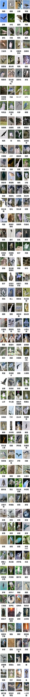

# 夜鹭页录 (YeluYelu)

<a href="https://yeluyelu.mynatapp.cc/">点击前往网站</a>

### 记录夜鹭奇妙拟态的图鉴网站，支持远程上传

本网站源于“夜鹭拟态图鉴”梗图， 图片来自各大社群与用户上传。

简单而言，这里名为“夜鹭”的都不是夜鹭，而其它的都是夜鹭。

期待你的最新上传！

<a href="https://space.bilibili.com/29602970" class="text-l font-bold underline">另可点击此处联系开发者</a>

### 欢迎重新部署

如果你对运营本网站有浓烈兴趣，可以自行部署服务。

请联系我并分发您的新网址！

部署步骤:
```bash
npm install
node server.js
```

启动后**用浏览器打开 http://localhost:3000/**。
注意 `/api` 本身不是页面（访问会显示 `Cannot GET /api`），它只是接口前缀，
真实接口在其下级，例如 `/api/birds`、`/api/birds/count`、`/api/detect/status`。

### 管理员（编辑 / 删除图片）

站点没有账号体系，管理权限是用一个口令换 **服务端签名的会话 token**：

1. 搜索框输入 `login 你的口令` 后**回车** → 进入管理员模式（每张卡片出现 ✏ / 🗑）。
2. 搜索框输入 `exit` 后**回车** → 退出。
3. 会话默认 12 小时（`ADMIN_SESSION_HOURS` 可调），token 存在浏览器 localStorage，
   刷新页面、编辑或删除之后**都不会掉出管理员模式**（旧版本每编辑一次就掉线，已修）。

**上公网前务必改掉默认口令**（默认仍是 `yelu666`，启动日志会警告）：

```bash
# 生成口令哈希：只把哈希写进环境变量，明文口令不落盘、不进仓库
node -e "console.log(require('crypto').createHash('sha256').update('你的新口令').digest('hex'))"

# Windows PowerShell
$env:ADMIN_KEY_HASH='上一步输出的 64 位十六进制'; node server.js
# Linux / macOS
ADMIN_KEY_HASH=<hash> node server.js
```

本地图省事也可以直接 `ADMIN_KEY=明文口令`，但公网请用 `ADMIN_KEY_HASH`。

安全设计：

- 口令只在 `POST /api/admin/login` 的请求体里出现一次，服务端只保存 SHA-256，比较用 `crypto.timingSafeEqual`；
- 登录接口限流 **8 次 / 5 分钟 / IP**，防字典爆破；
- 编辑 `PUT /api/birds/:id` 与删除 `DELETE /api/birds/:id` 必须带 `X-Admin-Token`，否则 **401 且连上传文件都不接收**；
- 上传 `POST /api/birds`、点赞、抽卡都是公开功能，不需要管理权限；
- 换口令会让所有旧 token 立即失效（会话密钥由口令哈希派生）；
- 口令不会出现在 URL 里（`login` 命令被前端截获，不会当成搜索词发出去），所以不会进服务端访问日志；
- 注意：natapp 免费隧道是 **http**，口令与 token 在链路上仍是明文。公网正式部署建议套 HTTPS，
  否则上面这些只在"防猜、防爆破、防日志泄漏"层面生效。

### 抽卡玩法

- **奖池**：站内全部图片。稀有度按**点赞数排名**切档 —— 传说 = 点赞最高的 2%，史诗 = 接下来 8%，稀有 = 30%，普通 = 其余 60%。
- **概率**：抽到某档的概率固定为 传说 5% / 史诗 15% / 稀有 30% / 普通 50%。因为稀有档人数少，
  单张传说远比单张普通难抽（约 1.25% vs 0.43%）—— 即"点赞越多越稀有"。
- **抽卡次数**：每日首次访问送 2 张单抽券 + 1 张十连券（没用完会留着）；每成功上传 1 张图片再奖励 1 张单抽券。
  没有十连券时，可以用 10 张单抽券代替。次数存服务端（`gacha_tickets.json`），刷新页面/清缓存都刷不出来。
- **抽卡**：单抽 1 张、十连 10 张（同一批内不重复）；随机数在服务端产生，前端改不了概率。
- **下载**：抽完可把本批图片打包成 zip 下载（文件名前缀带稀有度，中文名正常显示）。只打包本批，不保存历史收藏。
- **点赞**：每张图一个 ♥，同一 IP 对同一张图只能赞一次（再点即取消），计数存服务端 `likes.json`。

| 方法 | 路径 | 说明 |
|---|---|---|
| `POST` | `/api/birds/:id/like` | 点赞 / 取消点赞（按 IP） |
| `GET` | `/api/gacha/tickets` | 券数量 + 每日赠送 + 奖池概率（当天首次访问会发放每日额度） |
| `GET` | `/api/gacha/pool` | 只查奖池与概率 |
| `POST` | `/api/gacha/pull` | `{"count": 1}` 或 `{"count": 10}` 抽卡 |
| `POST` | `/api/gacha/zip` | `{"ids": [...]}` 打包本批图片（≤10 张，store 方式流式输出） |

### 站点配置（config.js）

所有关键参数集中在一个文件里，改完**重启服务**生效：

| 文件 | 说明 |
|---|---|
| `config.js` | **你实际改的就是这个**（已在 `.gitignore` 里，放 `ADMIN_KEY_HASH` 不会进仓库） |
| `config.example.js` | 模板/兜底：`config.js` 不存在时服务直接读它，所以新克隆开箱即用 |

优先级：**环境变量 > config.js > 内置默认值**（有环境变量覆盖时，启动日志会标出来源，例如 `(env:UPLOAD_DAILY_LIMIT)`）。

主要参数（详见文件内注释）：

| 参数 | 默认 | 说明 |
|---|---|---|
| `port` | 3000 | 监听端口 |
| `trustProxy` | `loopback` | Express trust proxy；代理不在本机时改成 `true`/跳数/IP 列表 |
| `corsOrigins` | localhost + 旧隧道域名 | 允许跨域访问的站点（同源访问不受影响） |
| `maxImageMB` | 20 | 单张图片上限，**前后端共用**（页面文案与前端校验都会跟着变） |
| `uploadDailyLimit` | 8 | 每 IP 每天成功上传次数；`0` = 不限量 |
| `writeBurstPerMinute` | 30 | 写操作（上传/编辑/删除/打包）限流 |
| `detectPerMinute` | 20 | 夜鹭检测限流 |
| `operationLogKeepDays` | 30 | 操作日志保留天数 |
| `quotaKeepDays` | 7 | 上传额度记录保留天数 |
| `adminKeyHash` / `adminKey` | 空 | 管理员口令（公网只填哈希）；空 = 默认 `yelu666` |
| `adminSessionHours` | 12 | 管理员会话有效期 |
| `adminLoginAttempts` / `adminLoginWindowMinutes` | 8 / 5 | 登录接口限流 |
| `gacha.dailySingleTickets` / `dailyTenTickets` | 2 / 1 | 每日登录赠送的券 |
| `gacha.tenPullSingleCost` | 10 | 没有十连券时，一次十连消耗几张单抽券 |
| `gacha.zipMaxImages` | 10 | 一次最多打包几张 |
| `gacha.tiers` | 传说/史诗/稀有/普通 | 档位的 `rate`（抽中概率）与 `share`（占奖池比例），两者都会自动归一到 1 |

想加档位就直接往 `gacha.tiers` 里加一项（前端会按顺序自动配色，也可在 `public/index.html` 的 `TIER_STYLE` 里指定颜色）；概率/占比总和不是 1 时服务会自动归一并在启动日志里警告。

### 上传额度与限流

每天每个 IP 的成功上传次数由服务端统一计数（存在 `ip_operations.json`），**前端只展示服务端返回的数字**，
不再自己算一套，因此不会出现"页面显示还剩几次、上传却提示频率超限"。

- 计入额度：新增图片（`POST /api/birds`）、带新图的编辑（`PUT` 且带 `image`）
- 不计入额度：删除、仅改名的编辑（只受每分钟 30 次防刷限流约束）
- 只有响应 2xx 才真正消耗额度：传错格式、名称不合格、超限被拒都会把额度退回来，也不会留下孤儿图片
- 额度按自然日重置（服务器本地时间次日 00:00）
- 前端可从 `GET /api/upload-quota` 及 `X-RateLimit-Limit` / `X-RateLimit-Remaining` / `X-RateLimit-Reset` 响应头拿到剩余次数

可用环境变量调整（都有默认值，不设也能跑）：

| 变量 | 默认 | 说明 |
|---|---|---|
| `UPLOAD_DAILY_LIMIT` | `8` | 每 IP 每天允许的成功上传次数；`0` / `off` / `unlimited` / 负数 = **不限量**（本地测试用） |
| `TRUST_PROXY` | `loopback` | Express `trust proxy` 设置。默认只信任本机回环代理（natapp 场景，客户端无法靠伪造 `X-Forwarded-For` 换 IP 刷额度）；代理不在本机时按需设为 `true` / 跳数 / IP 或 CIDR 列表 |
| `PORT` | `3000` | 监听端口 |

```bash
# 本地测试：临时关掉每日上传次数
UPLOAD_DAILY_LIMIT=0 node server.js            # Linux / macOS
$env:UPLOAD_DAILY_LIMIT='0'; node server.js    # Windows PowerShell
```

额度记录存在 `ip_operations.json`（保留最近 7 天），删掉该文件即可立刻重置额度。

### 上传时的夜鹭检测（可选）

上传图片时会调用单类 YOLO 模型做检测：检出夜鹭直接通过，未检出则提示
"未检出夜鹭，夜师傅今天出什么COS~"，用户仍可选择继续上传。

**本仓库不含模型文件**，需要自行把 `yelu.onnx` 放入 `models/` 目录，
具体放置方式与配置见 `models/README.md`。
没有模型时服务照常运行，检测会自动跳过，不影响上传。

`docs/detection-scores.csv` 是 `public/images` 全部图片的检测分数清单，
可按分数排序人工复核检测效果。

详见 `docs/detection-implementation.md`。

### 支持导出长图

点击页面底部的“导出图片”，即可导出当前加载的所有图鉴！

当前版本：夜鹭页录_v2025.06.03_1602

<p>
  
</p>
